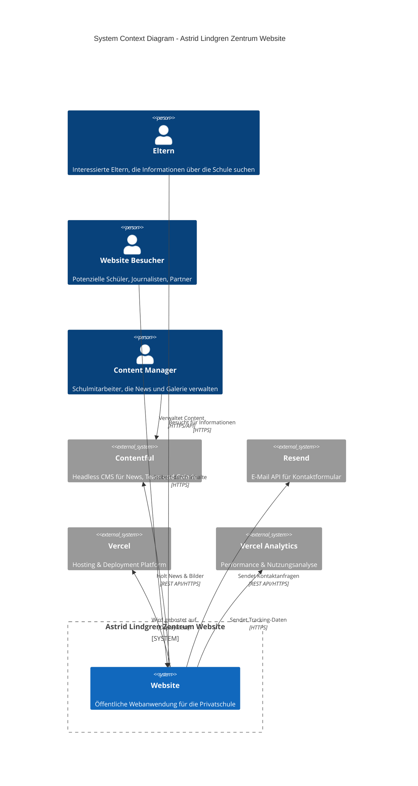
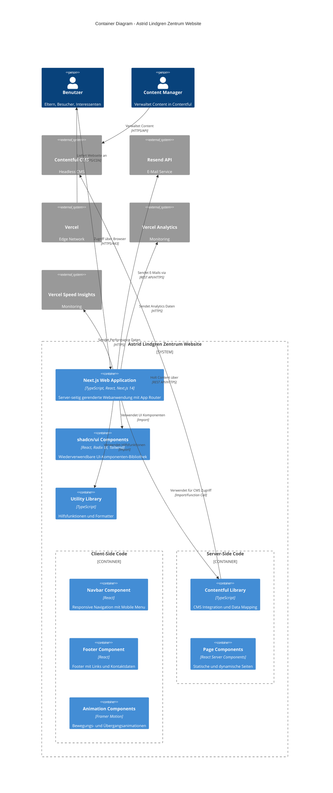
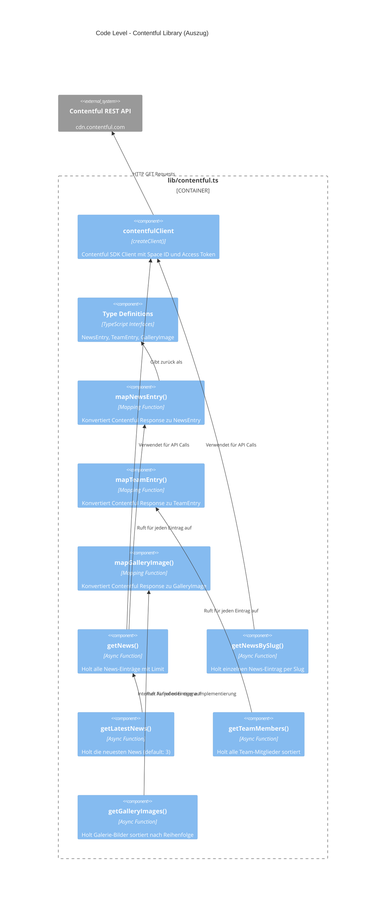

# C4 Modell Dokumentation - Astrid Lindgren Zentrum Website

## Übersicht

Dieses Dokument beschreibt die Architektur der Astrid Lindgren Zentrum Website nach dem [C4 Modell](https://c4model.com/) von Simon Brown.

Das C4 Modell besteht aus vier Ebenen:
1. **Context** (System Context) - Zeigt das System im Kontext seiner Umgebung
2. **Container** (Container) - Zeigt die technischen Container und ihre Beziehungen
3. **Component** (Komponenten) - Zeigt die Komponenten innerhalb der Container
4. **Code** (Code) - Zeigt die Code-Ebene (optional)

---

## Level 1: System Context Diagram

Das Astrid Lindgren Zentrum Website-System ist eine öffentliche Webanwendung für eine Privatschule in Wien.



### Akteure (Persons)

| Akteur | Beschreibung |
|--------|-------------|
| **Eltern** | Interessierte Eltern, die Informationen über die Schule suchen, Schulprogramme erkunden oder ihre Kinder anmelden möchten |
| **Website Besucher** | Allgemeine Besucher wie potenzielle Schüler, Journalisten, Bildungspartner oder Neugierige |
| **Content Manager** | Schulmitarbeiter, die über Contentful News-Artikel, Team-Informationen und Galerie-Bilder verwalten |

### Externe Systeme

| System | Zweck |
|--------|-------|
| **Contentful** | Headless CMS zur Verwaltung von dynamischem Content (News, Team-Mitglieder, Galerie-Bilder) |
| **Resend** | E-Mail-Service für das Versenden von Kontaktanfragen aus dem Kontaktformular |
| **Vercel** | Cloud-Hosting-Platform für das Deployment und die Bereitstellung der Website |
| **Vercel Analytics** | Tracking von Performance-Metriken und Nutzungsstatistiken |

---

## Level 2: Container Diagram

Die Anwendung besteht aus mehreren technischen Containern, die zusammenarbeiten.



### Container Beschreibungen

| Container | Technologie | Beschreibung |
|-----------|-------------|--------------|
| **Next.js Web Application** | TypeScript, React, Next.js 14 | Hauptanwendung mit App Router, Server-Side Rendering und Static Site Generation |
| **shadcn/ui Components** | React, Radix UI, Tailwind CSS | Wiederverwendbare UI-Komponenten wie Button, Card, Input, etc. |
| **Utility Library** | TypeScript | Gemeinsame Hilfsfunktionen wie `cn()` für Klassen-Merging und `formatDate()` |
| **Contentful Library** | TypeScript, Contentful SDK | Abstraktionsschicht für Contentful API mit Typ-Definitionen und Mapping-Funktionen |
| **Navbar Component** | React, Framer Motion | Responsive Navigation mit Mobile Menu und Animationen |
| **Footer Component** | React | Footer mit Navigationslinks, Kontaktdaten und Social Media |
| **Page Components** | React Server Components | Server-seitig gerenderte Seiten für bessere SEO und Performance |

### Technologie-Stack

- **Framework**: Next.js 14 mit App Router
- **Language**: TypeScript 5.5+
- **Styling**: Tailwind CSS 3.4+
- **UI Library**: shadcn/ui (basierend auf Radix UI)
- **Animationen**: Framer Motion 11.3+
- **CMS**: Contentful SDK 10.15+
- **E-Mail**: Resend 3.5+
- **Icons**: Lucide React
- **Deployment**: Vercel
- **Analytics**: Vercel Analytics & Speed Insights

---

## Level 3: Component Diagram

Detaillierte Ansicht der Next.js Web Application und ihrer Komponenten.

```mermaid
C4Component
    title Component Diagram - Next.js Web Application
    
    Person(user, "Website Benutzer")
    
    Container_Boundary(app, "Next.js App") {
        Component(layout, "Root Layout", "TypeScript/React", "Grundlayout mit Fonts, Metadaten, Navbar, Footer")
        Component(globals_css, "Global Styles", "CSS", "Tailwind Direktiven und Custom Properties")
        
        Container_Boundary(pages_dir, "App Router Pages") {
            Component(page_home, "Home Page", "RSC", "Startseite mit Hero, Features, News, CTA")
            Component(page_about, "Über uns Page", "RSC", "Informationen über die Schule")
            Component(page_school, "Schule Page", "RSC", "Schulprogramm und Konzept")
            Component(page_news_list, "News List Page", "RSC", "Übersicht aller News")
            Component(page_news_detail, "News Detail Page", "RSC", "Einzelne News-Artikel")
            Component(page_gallery, "Galerie Page", "RSC + Client", "Bildergalerie mit Lightbox")
            Component(page_contact, "Kontakt Page", "RSC + Client", "Kontaktformular und Infos")
            Component(page_legal, "Legal Pages", "RSC", "Impressum & Datenschutz")
        }
        
        Container_Boundary(components_dir, "Components") {
            Component(navbar, "Navbar", "Client Component", "Responsive Navigation")
            Component(footer, "Footer", "Server Component", "Seitenfooter")
            Component(home_page, "HomePage", "Client Component", "Komplexe Startseiten-UI mit Animationen")
            Component(gallery_client, "GalerieClient", "Client Component", "Interaktive Galerie mit Lightbox")
            Component(contact_client, "KontaktClient", "Client Component", "Kontaktformular mit State")
            
            Container_Boundary(ui_dir, "UI Components (shadcn/ui)") {
                Component(btn, "Button", "React", "Interaktive Buttons mit Varianten")
                Component(card, "Card", "React", "Card Container Komponente")
                Component(input, "Input", "React", "Text Input Felder")
                Component(textarea, "Textarea", "React", "Mehrzeilige Textfelder")
                Component(label, "Label", "React", "Formular Labels")
                Component(accordion, "Accordion", "React", "Aufklappbare Bereiche")
            }
        }
        
        Container_Boundary(lib_dir, "Library") {
            Component(contentful_client, "Contentful Client", "TypeScript", "CMS API Client")
            Component(utils_lib, "Utils", "TypeScript", "Hilfsfunktionen")
            
            Container_Boundary(types_dir, "Type Definitions") {
                Component(news_type, "NewsEntry Type", "TypeScript", "Typ für News-Artikel")
                Component(team_type, "TeamEntry Type", "TypeScript", "Typ für Team-Mitglieder")
                Component(gallery_type, "GalleryImage Type", "TypeScript", "Typ für Galerie-Bilder")
            }
        }
    }
    
    System_Ext(contentful, "Contentful CMS")
    System_Ext(resend, "Resend API")
    System_Ext(vercel_analytics, "Vercel Analytics")
    
    Rel(user, layout, "Zugriff auf Seiten via")
    Rel(layout, globals_css, "Lädt Styles")
    Rel(layout, navbar, "Rendert")
    Rel(layout, footer, "Rendert")
    
    Rel(layout, page_home, "Rendert für /")
    Rel(layout, page_about, "Rendert für /ueber-uns")
    Rel(layout, page_school, "Rendert für /schule")
    Rel(layout, page_news_list, "Rendert für /news")
    Rel(layout, page_news_detail, "Rendert für /news/[slug]")
    Rel(layout, page_gallery, "Rendert für /galerie")
    Rel(layout, page_contact, "Rendert für /kontakt")
    
    Rel(page_home, home_page, "Verwendet")
    Rel(page_gallery, gallery_client, "Verwendet")
    Rel(page_contact, contact_client, "Verwendet")
    
    Rel(home_page, btn, "Verwendet")
    Rel(home_page, card, "Verwendet")
    Rel(contact_client, btn, "Verwendet")
    Rel(contact_client, input, "Verwendet")
    Rel(contact_client, textarea, "Verwendet")
    Rel(contact_client, label, "Verwendet")
    
    Rel(page_home, contentful_client, "Ruft getLatestNews() auf")
    Rel(page_news_list, contentful_client, "Ruft getNews() auf")
    Rel(page_news_detail, contentful_client, "Ruft getNewsBySlug() auf")
    Rel(page_gallery, contentful_client, "Ruft getGalleryImages() auf")
    
    Rel(contentful_client, news_type, "Verwendet")
    Rel(contentful_client, team_type, "Verwendet")
    Rel(contentful_client, gallery_type, "Verwendet")
    Rel(contentful_client, utils_lib, "Verwendet für URL-Formatierung")
    
    Rel(contentful_client, contentful, "HTTP API Calls")
    Rel(contact_client, resend, "Sendet E-Mails via API")
    Rel(layout, vercel_analytics, "Initialisiert Tracking")
    
    UpdateLayoutConfig($c4ShapeInRow="3", $c4BoundaryInRow="3")
```



### Komponentenbeschreibungen

#### Layout & Pages

| Komponente | Typ | Beschreibung |
|------------|-----|--------------|
| **Root Layout** | Server Component | Hauptlayout in `app/layout.tsx`. Definiert Fonts (Nunito, Merriweather), Metadaten für SEO, und das Grundgerüst mit Navbar und Footer |
| **Home Page** | Server Component | Startseite in `app/page.tsx`. Server-seitiges Daten-Fetching für News |
| **Über uns Page** | Server Component | Statische Seite mit Schulinformationen |
| **Schule Page** | Server Component | Statische Seite mit Schulprogramm |
| **News List** | Server Component | Listet alle News-Artikel mit Pagination |
| **News Detail** | Server Component | Zeigt einzelne News-Artikel basierend auf slug |
| **Galerie Page** | Server Component + Client | Kombiniert server-seitiges Daten-Fetching mit interaktiver Client-Galerie |
| **Kontakt Page** | Server Component + Client | Kombiniert statische Kontaktinfos mit interaktivem Formular |

#### UI Components (shadcn/ui)

| Komponente | Zweck |
|------------|-------|
| **Button** | Primäre UI-Interaktionselemente mit verschiedenen Varianten (primary, outline, ghost) |
| **Card** | Container für Inhaltsblöcke mit konsistentem Styling |
| **Input** | Formular-Eingabefelder mit Validierung |
| **Textarea** | Mehrzeilige Texteingabe für Nachrichten |
| **Label** | Accessible Labels für Formularfelder |
| **Accordion** | Aufklappbare Inhaltsbereiche für FAQs |

#### Client Components

| Komponente | Beschreibung |
|------------|--------------|
| **Navbar** | Responsive Navigation mit Mobile Menu, React State für Toggle, Framer Motion für Animationen |
| **HomePage** | Komplexe Startseite mit Hero-Section, Features, Statistiken, News-Preview und CTA |
| **GalerieClient** | Interaktive Bildergalerie mit Lightbox, Navigation, Keyboard Support |
| **KontaktClient** | Kontaktformular mit Form-State, Validierung und Submit-Handling |

#### Library

| Komponente | Beschreibung |
|------------|--------------|
| **Contentful Client** | `lib/contentful.ts` - Enthält alle Funktionen für CMS-Zugriff: `getNews()`, `getNewsBySlug()`, `getLatestNews()`, `getTeamMembers()`, `getGalleryImages()`. Inklusive Mapping-Funktionen von Contentful-Format zu App-Format |
| **Utils** | `lib/utils.ts` - `cn()` für Tailwind-Klassen-Merging, `formatDate()` für Datumsformatierung |
| **Type Definitions** | `NewsEntry`, `TeamEntry`, `GalleryImage` - Strictly typed Interfaces für CMS-Daten |

### Datenfluss

1. **Seitenaufruf**: Benutzer ruft Seite auf
2. **Server Rendering**: Next.js rendert Server Components (RSC)
3. **Daten-Fetching**: Contentful Client holt Daten von CMS (bei dynamischen Seiten)
4. **Hydration**: Client Components werden im Browser hydratisiert
5. **Interaktion**: Benutzer interagiert mit Client Components (Formulare, Galerie)
6. **API Calls**: Bei Bedarf werden API-Aufrufe an Resend oder Contentful gemacht

---

## Level 4: Code Diagram (Auszug)

Diese Ebene zeigt die Implementationsdetails auf Code-Ebene.

### Contentful Integration - Code-Struktur



### Page Component Pattern

```typescript
// Beispiel: app/news/page.tsx (Server Component)
import { getNews } from '@/lib/contentful'

export const revalidate = 120 // ISR: Alle 2 Minuten neu generieren

export default async function NewsPage() {
  const news = await getNews(10)
  return <NewsList news={news} />
}
```

### Client Component Pattern

```typescript
// Beispiel: components/galerie-client.tsx (Client Component)
'use client'

import { useState } from 'react'
import Lightbox from 'yet-another-react-lightbox'

export default function GalerieClient({ images }) {
  const [open, setOpen] = useState(false)
  const [index, setIndex] = useState(0)
  
  // Interaktive Logik hier...
}
```

### Architektur-Patterns

| Pattern | Anwendung |
|---------|-----------|
| **Server-Side Rendering (SSR)** | Pages verwenden React Server Components für bessere SEO und initiale Performance |
| **Incremental Static Regeneration (ISR)** | Pages mit `revalidate` werden periodisch neu generiert |
| **Client-Side Hydration** | Interaktive Komponenten mit `'use client'` werden im Browser hydratisiert |
| **Component Composition** | Kleine, wiederverwendbare UI-Komponenten aus shadcn/ui |
| **Data Mapping** | Contentful-Daten werden in App-spezifische Typen gemappt |
| **Error Handling** | Graceful Degradation bei fehlenden CMS-Daten |
| **Environment Configuration** | Sensitive Daten (API Keys) über Environment Variables |

---

## Technologie-Stack Detail

### Kern-Abhängigkeiten

```json
{
  "next": "14.2.5",
  "react": "^18.3.1",
  "react-dom": "^18.3.1",
  "typescript": "^5.5.4"
}
```

### Styling & UI

| Package | Version | Zweck |
|---------|---------|-------|
| tailwindcss | ^3.4.7 | Utility-First CSS Framework |
| @radix-ui/* | ^1.x | Accessible UI Primitives |
| class-variance-authority | ^0.7.0 | Komponenten-Varianten |
| clsx | ^2.1.1 | Conditional Class Names |
| tailwind-merge | ^2.4.0 | Tailwind Klassen-Merging |

### Animation

| Package | Version | Zweck |
|---------|---------|-------|
| framer-motion | ^11.3.8 | React Animation Library |

### CMS & API

| Package | Version | Zweck |
|---------|---------|-------|
| contentful | ^10.15.1 | Contentful SDK |
| resend | ^3.5.0 | E-Mail API |

### Monitoring

| Package | Version | Zweck |
|---------|---------|-------|
| @vercel/analytics | ^1.6.1 | Usage Analytics |
| @vercel/speed-insights | ^1.3.1 | Performance Monitoring |

### Formulare

| Package | Version | Zweck |
|---------|---------|-------|
| react-hook-form | ^7.52.1 | Formular-State-Management |
| zod | ^3.23.8 | Schema-Validierung |
| @hookform/resolvers | ^3.9.0 | Form-Resolver für Zod |

### Galerie

| Package | Version | Zweck |
|---------|---------|-------|
| yet-another-react-lightbox | ^3.17.0 | Lightbox für Bildergalerie |

### Icons

| Package | Version | Zweck |
|---------|---------|-------|
| lucide-react | ^0.424.0 | Icon Library |

---

## Deployment-Architektur

```mermaid
C4Deployment
    title Deployment Diagram - Astrid Lindgren Zentrum Website
    
    Deployment_Node(user_browser, "Benutzer Browser", "Chrome, Firefox, Safari, Edge") {
        Container(browser, "Web Browser", "HTML, CSS, JS")
    }
    
    Deployment_Node(vercel_edge, "Vercel Edge Network", "Global CDN") {
        Deployment_Node(vercel_infra, "Vercel Infrastructure") {
            Container(next_server, "Next.js Server", "Node.js Runtime", "Server-Side Rendering")
            Container(static_files, "Static Files", "HTML/CSS/JS", "Pre-rendered Pages")
            Container(edge_funcs, "Edge Functions", "V8 Isolate", "Middleware & API Routes")
        }
    }
    
    Deployment_Node(apis, "External APIs") {
        Container(contentful_api, "Contentful API", "REST", "CDN.contentful.com")
        Container(resend_api, "Resend API", "REST", "api.resend.com")
    }
    
    Rel(browser, vercel_edge, "HTTPS Request", "443")
    Rel(vercel_edge, next_server, "Dynamic Routes", "Internal")
    Rel(vercel_edge, static_files, "Static Routes", "Cached")
    Rel(next_server, contentful_api, "CMS API Calls", "HTTPS/443")
    Rel(edge_funcs, resend_api, "E-Mail API", "HTTPS/443")
```

### Hosting-Details

- **Platform**: Vercel
- **Framework**: Next.js 14
- **Runtime**: Node.js (Serverless Functions)
- **CDN**: Vercel Edge Network
- **Region**: Auto (weltweite Verteilung)

### Build-Konfiguration

```json
// vercel.json
{
  "buildCommand": "npm run build",
  "installCommand": "npm install",
  "outputDirectory": ".next",
  "framework": "nextjs"
}
```

### Environment Variables

| Variable | Beschreibung |
|----------|--------------|
| `CONTENTFUL_SPACE_ID` | Contentful Space Identifier |
| `CONTENTFUL_ACCESS_TOKEN` | Contentful API Access Token |
| `RESEND_API_KEY` | Resend API Key für E-Mail Versand |

---

## Seiten-Struktur

| Route | Seite | Datenquelle | Besonderheiten |
|-------|-------|-------------|----------------|
| `/` | Home | Contentful (News) | Hero, Features, Stats, News-Preview, CTA |
| `/ueber-uns` | Über uns | Statisch | Schulinformationen, Team |
| `/schule` | Schule | Statisch | Schulprogramm, Konzept |
| `/news` | News Liste | Contentful | Alle News-Artikel |
| `/news/[slug]` | News Detail | Contentful | Einzelner Artikel |
| `/galerie` | Galerie | Contentful | Bildergalerie mit Lightbox |
| `/kontakt` | Kontakt | Statisch + Resend | Kontaktformular |
| `/impressum` | Impressum | Statisch | Rechtliche Informationen |
| `/datenschutz` | Datenschutz | Statisch | DSGVO-Informationen |

---

## Zusammenfassung

Die Astrid Lindgren Zentrum Website ist eine moderne, auf Next.js 14 basierende Webanwendung mit folgenden architektonischen Merkmalen:

### Stärken
- **SEO-optimiert** durch Server-Side Rendering
- **Schnell** durch Static Site Generation und CDN
- **CMS-gesteuert** durch Contentful Integration
- **Responsive** durch Mobile-First Design mit Tailwind
- **Accessible** durch Verwendung von Radix UI Primitives
- **Performant** durch Optimierungen (Bilder, Fonts, Code-Splitting)

### Sicherheit
- API Keys in Environment Variables
- Keine sensiblen Daten im Client
- HTTPS-only Kommunikation

### Skalierbarkeit
- Serverless Architecture auf Vercel
- CDN für statische Assets
- CMS-basierte Content-Verwaltung

---

*Dokumentation erstellt nach C4 Modell Standards*
*Version: 1.0*
*Datum: 2025*
