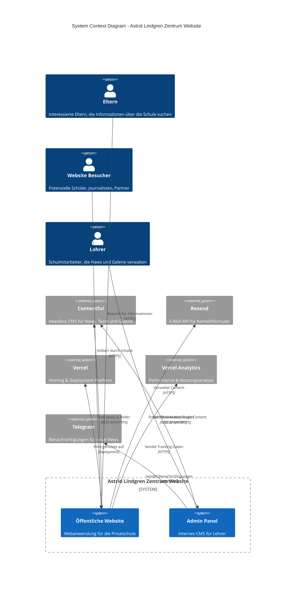
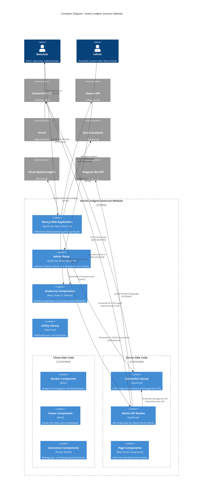
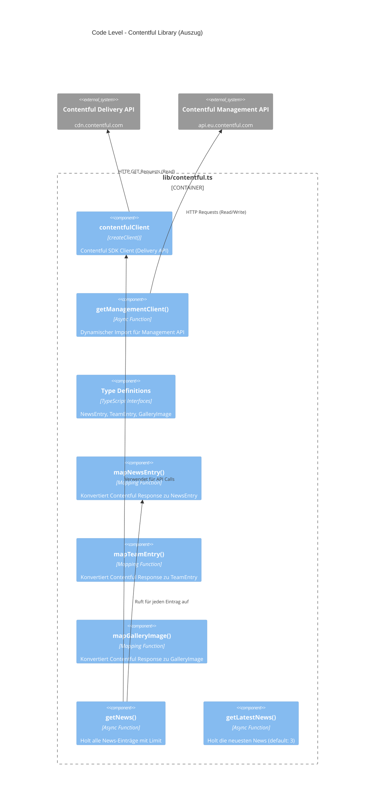
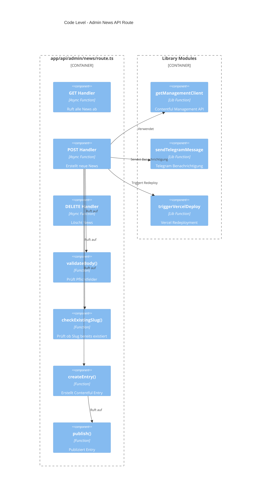

# C4 Modell Dokumentation - Astrid Lindgren Zentrum Website

## Übersicht

Dieses Dokument beschreibt die Architektur der Astrid Lindgren Zentrum Website nach dem [C4 Modell](https://c4model.com/) von Simon Brown.

Das C4 Modell besteht aus vier Ebenen:
1. **Context** (System Context) - Zeigt das System im Kontext seiner Umgebung
2. **Container** (Container) - Zeigt die technischen Container und ihre Beziehungen
3. **Component** (Komponenten) - Zeigt die Komponenten innerhalb der Container
4. **Code** (Code) - Zeigt die Code-Ebene (optional)

---

## Level 1: System Context Diagram

Das Astrid Lindgren Zentrum Website-System ist eine öffentliche Webanwendung für eine Privatschule in Wien mit integriertem Admin-Panel für Lehrer.



### Akteure (Persons)

| Akteur | Beschreibung |
|--------|-------------|
| **Eltern** | Interessierte Eltern, die Informationen über die Schule suchen, Schulprogramme erkunden oder ihre Kinder anmelden möchten |
| **Website Besucher** | Allgemeine Besucher wie potenzielle Schüler, Journalisten, Bildungspartner oder Neugierige |
| **Lehrer** | Schulmitarbeiter mit Zugriff auf das Admin-Panel zum Verwalten von News und Galerie |

### Externe Systeme

| System | Zweck |
|--------|-------|
| **Contentful** | Headless CMS zur Verwaltung von dynamischem Content (News, Team-Mitglieder, Galerie-Bilder) |
| **Resend** | E-Mail-Service für das Versenden von Kontaktanfragen aus dem Kontaktformular |
| **Vercel** | Cloud-Hosting-Platform für das Deployment und die Bereitstellung der Website |
| **Vercel Analytics** | Tracking von Performance-Metriken und Nutzungsstatistiken |
| **Telegram** | Bot-Benachrichtigungen bei neuen News-Artikeln |

---

## Level 2: Container Diagram

Die Anwendung besteht aus mehreren technischen Containern, die zusammenarbeiten.



### Container Beschreibungen

| Container | Technologie | Beschreibung |
|-----------|-------------|--------------|
| **Next.js Web Application** | TypeScript, React, Next.js 14 | Öffentliche Website mit App Router, Server-Side Rendering und Static Site Generation |
| **Admin Panel** | TypeScript, React, Next.js 14 | Internes CMS für Lehrer mit Login, News-Verwaltung und Galerie-Upload |
| **shadcn/ui Components** | React, Radix UI, Tailwind CSS | Wiederverwendbare UI-Komponenten wie Button, Card, Input, etc. |
| **Utility Library** | TypeScript | Gemeinsame Hilfsfunktionen wie `cn()` für Klassen-Merging und `formatDate()` |
| **Contentful Library** | TypeScript, Contentful SDK | Abstraktionsschicht für Contentful API (Delivery & Management) |
| **Admin API Routes** | TypeScript, Next.js API Routes | Server-seitige API-Endpunkte für Admin-Panel (Create, Read, Update, Delete) |
| **Navbar Component** | React, Framer Motion | Responsive Navigation mit Mobile Menu und Animationen |
| **Footer Component** | React | Footer mit Navigationslinks, Kontaktdaten und Social Media |
| **Page Components** | React Server Components | Server-seitig gerenderte Seiten für bessere SEO und Performance |

### Technologie-Stack

- **Framework**: Next.js 14 mit App Router
- **Language**: TypeScript 5.5+
- **Styling**: Tailwind CSS 3.4+
- **UI Library**: shadcn/ui (basierend auf Radix UI)
- **Animationen**: Framer Motion 11.3+
- **CMS**: Contentful SDK 10.15+ (Delivery API) & contentful-management 11.35+ (Management API)
- **E-Mail**: Resend 3.5+
- **Messaging**: Telegram Bot API
- **Icons**: Lucide React
- **Deployment**: Vercel
- **Analytics**: Vercel Analytics & Speed Insights

---

## Level 3: Component Diagram

Detaillierte Ansicht der Next.js Web Application und ihrer Komponenten.

```mermaid
C4Component
    title Component Diagram - Next.js Web Application
    
    Person(user, "Website Benutzer")
    Person(lehrer, "Lehrer (Admin)")
    
    Container_Boundary(app, "Next.js App") {
        Component(layout, "Root Layout", "TypeScript/React", "Grundlayout mit Fonts, Metadaten, Navbar, Footer")
        Component(globals_css, "Global Styles", "CSS", "Tailwind Direktiven und Custom Properties")
        
        Container_Boundary(pages_dir, "App Router Pages (Public)") {
            Component(page_home, "Home Page", "RSC", "Startseite mit Hero, Features, News, CTA")
            Component(page_about, "Über uns Page", "RSC", "Informationen über die Schule")
            Component(page_school, "Schule Page", "RSC", "Schulprogramm und Konzept")
            Component(page_news_list, "News List Page", "RSC", "Übersicht aller News")
            Component(page_news_detail, "News Detail Page", "RSC", "Einzelne News-Artikel")
            Component(page_gallery, "Galerie Page", "RSC + Client", "Bildergalerie mit Lightbox")
            Component(page_contact, "Kontakt Page", "RSC + Client", "Kontaktformular und Infos")
            Component(page_legal, "Legal Pages", "RSC", "Impressum & Datenschutz")
        }
        
        Container_Boundary(admin_dir, "Admin Panel Pages") {
            Component(admin_login, "Admin Login", "Client Component", "Passwort-basierte Authentifizierung")
            Component(admin_dashboard, "Admin Dashboard", "Client Component", "Übersicht für Lehrer")
            Component(admin_news_list, "Admin News List", "Client Component", "News verwalten mit Löschen")
            Component(admin_news_new, "Admin News Create", "Client Component", "Neue News erstellen")
            Component(admin_gallery, "Admin Gallery", "Client Component", "Bilder hochladen & löschen")
        }
        
        Container_Boundary(api_dir, "API Routes") {
            Component(api_news, "News API", "API Route", "GET/POST/DELETE für News")
            Component(api_gallery, "Gallery API", "API Route", "GET/POST/DELETE für Galerie")
        }
        
        Container_Boundary(components_dir, "Components") {
            Component(navbar, "Navbar", "Client Component", "Responsive Navigation")
            Component(footer, "Footer", "Server Component", "Seitenfooter")
            Component(home_page, "HomePage", "Client Component", "Komplexe Startseiten-UI mit Animationen")
            Component(gallery_client, "GalerieClient", "Client Component", "Interaktive Galerie mit Lightbox")
            Component(contact_client, "KontaktClient", "Client Component", "Kontaktformular mit State")
            
            Container_Boundary(ui_dir, "UI Components (shadcn/ui)") {
                Component(btn, "Button", "React", "Interaktive Buttons mit Varianten")
                Component(card, "Card", "React", "Card Container Komponente")
                Component(input, "Input", "React", "Text Input Felder")
                Component(textarea, "Textarea", "React", "Mehrzeilige Textfelder")
                Component(label, "Label", "React", "Formular Labels")
                Component(accordion, "Accordion", "React", "Aufklappbare Bereiche")
            }
        }
        
        Container_Boundary(lib_dir, "Library") {
            Component(contentful_client, "Contentful Client", "TypeScript", "CMS API Client (Delivery)")
            Component(contentful_mgmt, "Contentful Management", "TypeScript", "CMS Management API Client")
            Component(admin_auth, "Admin Auth", "TypeScript", "Cookie-basierte Authentifizierung")
            Component(telegram_lib, "Telegram Integration", "TypeScript", "Bot-Benachrichtigungen")
            Component(deploy_hook, "Vercel Deploy Hook", "TypeScript", "Automatisches Redeployment")
            Component(utils_lib, "Utils", "TypeScript", "Hilfsfunktionen")
            
            Container_Boundary(types_dir, "Type Definitions") {
                Component(news_type, "NewsEntry Type", "TypeScript", "Typ für News-Artikel")
                Component(team_type, "TeamEntry Type", "TypeScript", "Typ für Team-Mitglieder")
                Component(gallery_type, "GalleryImage Type", "TypeScript", "Typ für Galerie-Bilder")
            }
        }
    }
    
    System_Ext(contentful, "Contentful CMS")
    System_Ext(resend, "Resend API")
    System_Ext(telegram, "Telegram Bot")
    System_Ext(vercel_analytics, "Vercel Analytics")
    
    Rel(user, layout, "Zugriff auf Seiten via")
    Rel(lehrer, admin_login, "Anmeldung via")
    
    Rel(layout, globals_css, "Lädt Styles")
    Rel(layout, navbar, "Rendert")
    Rel(layout, footer, "Rendert")
    
    Rel(layout, page_home, "Rendert für /")
    Rel(layout, page_news_list, "Rendert für /news")
    Rel(admin_login, admin_dashboard, "Weiterleitung nach Login")
    Rel(admin_dashboard, admin_news_list, "Navigation")
    Rel(admin_dashboard, admin_gallery, "Navigation")
    Rel(admin_news_list, admin_news_new, "Navigation")
    
    Rel(admin_news_new, api_news, "POST Request")
    Rel(admin_news_list, api_news, "GET/DELETE Request")
    Rel(admin_gallery, api_gallery, "GET/POST/DELETE Request")
    
    Rel(api_news, contentful_mgmt, "Ruft auf")
    Rel(api_gallery, contentful_mgmt, "Ruft auf")
    Rel(api_news, telegram_lib, "Sendet Benachrichtigung")
    Rel(api_news, deploy_hook, "Triggert Redeploy")
    
    Rel(page_home, home_page, "Verwendet")
    Rel(page_gallery, gallery_client, "Verwendet")
    Rel(page_contact, contact_client, "Verwendet")
    
    Rel(admin_login, admin_auth, "Verwendet")
    Rel(admin_dashboard, admin_auth, "Prüft Auth")
    
    Rel(contentful_mgmt, contentful, "HTTP API Calls (Management)")
    Rel(contentful_client, contentful, "HTTP API Calls (Delivery)")
    Rel(telegram_lib, telegram, "Sendet Nachrichten")
    Rel(deploy_hook, vercel_analytics, "Triggert Deployment")
    
    UpdateLayoutConfig($c4ShapeInRow="3", $c4BoundaryInRow="3")
```



### Komponentenbeschreibungen

#### Public Pages

| Komponente | Typ | Beschreibung |
|------------|-----|--------------|
| **Root Layout** | Server Component | Hauptlayout in `app/layout.tsx`. Definiert Fonts (Nunito, Merriweather), Metadaten für SEO, und das Grundgerüst mit Navbar und Footer |
| **Home Page** | Server Component | Startseite in `app/page.tsx`. Server-seitiges Daten-Fetching für News |
| **News List** | Server Component | Listet alle News-Artikel mit Pagination |
| **News Detail** | Server Component | Zeigt einzelne News-Artikel basierend auf slug |
| **Galerie Page** | Server Component + Client | Kombiniert server-seitiges Daten-Fetching mit interaktiver Client-Galerie |

#### Admin Panel Pages

| Komponente | Typ | Beschreibung |
|------------|-----|--------------|
| **Admin Login** | Client Component | Einfaches Passwort-Login mit Cookie-Authentifizierung |
| **Admin Dashboard** | Client Component | Übersicht mit Navigation zu News und Galerie |
| **Admin News List** | Client Component | Zeigt alle News mit Lösch-Funktion (Mülleimer-Icon) |
| **Admin News Create** | Client Component | Formular zum Erstellen neuer News mit Telegram-Benachrichtigung |
| **Admin Gallery** | Client Component | Bilder hochladen und löschen mit Drag & Drop |

#### API Routes

| Komponente | Endpunkte | Beschreibung |
|------------|-----------|--------------|
| **News API** | GET, POST, DELETE | `/api/admin/news` - CRUD-Operationen für News |
| **Gallery API** | GET, POST, DELETE | `/api/admin/gallery` - CRUD-Operationen für Galerie-Bilder |

#### UI Components (shadcn/ui)

| Komponente | Zweck |
|------------|-------|
| **Button** | Primäre UI-Interaktionselemente mit verschiedenen Varianten (primary, outline, ghost, destructive) |
| **Card** | Container für Inhaltsblöcke mit konsistentem Styling |
| **Input** | Formular-Eingabefelder mit Validierung |
| **Textarea** | Mehrzeilige Texteingabe für Nachrichten |
| **Label** | Accessible Labels für Formularfelder |
| **Accordion** | Aufklappbare Inhaltsbereiche |

#### Library Module

| Komponente | Beschreibung |
|------------|--------------|
| **Contentful Client** | `lib/contentful.ts` - Delivery API für lesenden Zugriff |
| **Contentful Management** | Dynamischer Import für Management API (siehe `getManagementClient()`) |
| **Admin Auth** | `lib/admin-auth.ts` - Cookie-basierte Authentifizierung für Admin-Panel |
| **Telegram Integration** | `lib/telegram.ts` - Bot-API für Benachrichtigungen bei neuen News |
| **Vercel Deploy Hook** | `lib/deploy.ts` - Automatisches Redeployment nach Content-Änderungen |
| **Utils** | `lib/utils.ts` - `cn()` für Tailwind-Klassen-Merging, `formatDate()` |

### Datenfluss

#### Public Website
1. **Seitenaufruf**: Benutzer ruft Seite auf
2. **Server Rendering**: Next.js rendert Server Components (RSC)
3. **Daten-Fetching**: Contentful Client holt Daten von CMS (bei dynamischen Seiten)
4. **Hydration**: Client Components werden im Browser hydratisiert
5. **Interaktion**: Benutzer interagiert mit Client Components (Formulare, Galerie)

#### Admin Panel
1. **Login**: Lehrer gibt Passwort ein → Cookie wird gesetzt (8h gültig)
2. **Dashboard**: Übersicht mit Navigation
3. **Content erstellen**: Formular wird ausgefüllt und abgesendet
4. **API Call**: POST an `/api/admin/news` oder `/api/admin/gallery`
5. **CMS Update**: Management API schreibt in Contentful
6. **Benachrichtigung**: Telegram-Bot sendet Nachricht (bei News)
7. **Redeployment**: Vercel Deploy Hook triggert automatisches Redeploy
8. **Live**: Neue Inhalte sind sofort auf der Website sichtbar

---

## Level 4: Code Diagram (Auszug)

### Contentful Integration - Code-Struktur



### Admin API Route - News



### Architektur-Patterns

| Pattern | Anwendung |
|---------|-----------|
| **Server-Side Rendering (SSR)** | Pages verwenden React Server Components für bessere SEO und initiale Performance |
| **Incremental Static Regeneration (ISR)** | Pages mit `revalidate` werden periodisch neu generiert |
| **Client-Side Hydration** | Interaktive Komponenten mit `'use client'` werden im Browser hydratisiert |
| **Component Composition** | Kleine, wiederverwendbare UI-Komponenten aus shadcn/ui |
| **Data Mapping** | Contentful-Daten werden in App-spezifische Typen gemappt |
| **Dynamic Imports** | Contentful Management Client wird dynamisch importiert um Build-Probleme zu vermeiden |
| **Error Handling** | Graceful Degradation bei fehlenden CMS-Daten |
| **Environment Configuration** | Sensitive Daten (API Keys) über Environment Variables |
| **Cookie-Based Auth** | Einfache Authentifizierung für Admin-Panel ohne komplexes Auth-System |
| **API Routes** | Server-seitige Endpunkte für CRUD-Operationen |

---

## Technologie-Stack Detail

### Kern-Abhängigkeiten

```json
{
  "next": "14.2.5",
  "react": "^18.3.1",
  "react-dom": "^18.3.1",
  "typescript": "^5.5.4"
}
```

### Styling & UI

| Package | Version | Zweck |
|---------|---------|-------|
| tailwindcss | ^3.4.7 | Utility-First CSS Framework |
| @radix-ui/* | ^1.x | Accessible UI Primitives |
| class-variance-authority | ^0.7.0 | Komponenten-Varianten |
| clsx | ^2.1.1 | Conditional Class Names |
| tailwind-merge | ^2.4.0 | Tailwind Klassen-Merging |

### Animation

| Package | Version | Zweck |
|---------|---------|-------|
| framer-motion | ^11.3.8 | React Animation Library |

### CMS & API

| Package | Version | Zweck |
|---------|---------|-------|
| contentful | ^10.15.1 | Contentful Delivery API SDK |
| contentful-management | ^11.35.0 | Contentful Management API SDK |
| resend | ^3.5.0 | E-Mail API |

### Monitoring & Notifications

| Package | Version | Zweck |
|---------|---------|-------|
| @vercel/analytics | ^1.6.1 | Usage Analytics |
| @vercel/speed-insights | ^1.3.1 | Performance Monitoring |

### Formulare

| Package | Version | Zweck |
|---------|---------|-------|
| react-hook-form | ^7.52.1 | Formular-State-Management |
| zod | ^3.23.8 | Schema-Validierung |
| @hookform/resolvers | ^3.9.0 | Form-Resolver für Zod |

### Galerie

| Package | Version | Zweck |
|---------|---------|-------|
| yet-another-react-lightbox | ^3.17.0 | Lightbox für Bildergalerie |

### Icons

| Package | Version | Zweck |
|---------|---------|-------|
| lucide-react | ^0.424.0 | Icon Library |

---

## Deployment-Architektur

```mermaid
C4Deployment
    title Deployment Diagram - Astrid Lindgren Zentrum Website
    
    Deployment_Node(user_browser, "Benutzer Browser", "Chrome, Firefox, Safari, Edge") {
        Container(browser, "Web Browser", "HTML, CSS, JS")
    }
    
    Deployment_Node(admin_browser, "Lehrer Browser", "Chrome, Firefox, Safari, Edge") {
        Container(admin_ui, "Admin Panel", "React App")
    }
    
    Deployment_Node(vercel_edge, "Vercel Edge Network", "Global CDN") {
        Deployment_Node(vercel_infra, "Vercel Infrastructure") {
            Container(next_server, "Next.js Server", "Node.js Runtime", "Server-Side Rendering")
            Container(static_files, "Static Files", "HTML/CSS/JS", "Pre-rendered Pages")
            Container(api_routes, "API Routes", "Node.js Runtime", "Admin API Endpoints")
            Container(edge_funcs, "Edge Functions", "V8 Isolate", "Middleware")
        }
    }
    
    Deployment_Node(apis, "External APIs") {
        Container(contentful_delivery, "Contentful Delivery", "REST", "cdn.contentful.com")
        Container(contentful_mgmt, "Contentful Management", "REST", "api.eu.contentful.com")
        Container(resend_api, "Resend API", "REST", "api.resend.com")
        Container(telegram_api, "Telegram Bot API", "REST", "api.telegram.org")
    }
    
    Rel(browser, vercel_edge, "HTTPS Request", "443")
    Rel(admin_ui, vercel_edge, "HTTPS Request", "443")
    Rel(admin_ui, api_routes, "Admin API Calls", "Internal")
    Rel(vercel_edge, next_server, "Dynamic Routes", "Internal")
    Rel(vercel_edge, static_files, "Static Routes", "Cached")
    Rel(api_routes, contentful_mgmt, "CMS Write Operations", "HTTPS/443")
    Rel(next_server, contentful_delivery, "CMS Read Operations", "HTTPS/443")
    Rel(edge_funcs, resend_api, "E-Mail API", "HTTPS/443")
    Rel(api_routes, telegram_api, "Notifications", "HTTPS/443")
```

### Hosting-Details

- **Platform**: Vercel
- **Framework**: Next.js 14
- **Runtime**: Node.js (Serverless Functions)
- **CDN**: Vercel Edge Network
- **Region**: Auto (weltweite Verteilung)
- **Contentful Region**: EU (api.eu.contentful.com)

### Build-Konfiguration

```json
// vercel.json
{
  "buildCommand": "npm run build",
  "installCommand": "npm install",
  "outputDirectory": ".next",
  "framework": "nextjs"
}
```

### Environment Variables

| Variable | Beschreibung | Erforderlich für |
|----------|--------------|------------------|
| `CONTENTFUL_SPACE_ID` | Contentful Space Identifier | Website + Admin |
| `CONTENTFUL_ACCESS_TOKEN` | Contentful Delivery API Token | Website (Lesen) |
| `CONTENTFUL_MANAGEMENT_TOKEN` | Contentful Management API Token | Admin (Schreiben) |
| `ADMIN_PASSWORD` | Passwort für Admin-Panel Login | Admin Panel |
| `TELEGRAM_BOT_TOKEN` | Telegram Bot Token | Admin (optional) |
| `TELEGRAM_CHAT_ID` | Telegram Chat ID für Benachrichtigungen | Admin (optional) |
| `VERCEL_DEPLOY_HOOK_URL` | Vercel Deploy Hook URL | Admin (optional) |
| `RESEND_API_KEY` | Resend API Key für E-Mail Versand | Kontaktformular |

---

## Seiten-Struktur

### Public Routes

| Route | Seite | Datenquelle | Besonderheiten |
|-------|-------|-------------|----------------|
| `/` | Home | Contentful (News) | Hero, Features, Stats, News-Preview, CTA |
| `/ueber-uns` | Über uns | Statisch | Schulinformationen, Team |
| `/schule` | Schule | Statisch | Schulprogramm, Konzept |
| `/news` | News Liste | Contentful | Alle News-Artikel |
| `/news/[slug]` | News Detail | Contentful | Einzelner Artikel |
| `/galerie` | Galerie | Contentful | Bildergalerie mit Lightbox |
| `/kontakt` | Kontakt | Statisch + Resend | Kontaktformular |
| `/impressum` | Impressum | Statisch | Rechtliche Informationen |
| `/datenschutz` | Datenschutz | Statisch | DSGVO-Informationen |

### Admin Routes

| Route | Seite | Funktion | Zugriff |
|-------|-------|----------|---------|
| `/admin` | Login | Passwort-basierte Anmeldung | Öffentlich |
| `/admin/dashboard` | Dashboard | Übersicht und Navigation | Authentifiziert |
| `/admin/news` | News Liste | Alle News anzeigen + Löschen | Authentifiziert |
| `/admin/news/new` | News erstellen | Neuer Artikel + Telegram Notification | Authentifiziert |
| `/admin/galerie` | Galerie | Bilder hochladen & löschen | Authentifiziert |

---

## Admin-Panel Features

### Funktionen

| Feature | Beschreibung |
|---------|-------------|
| **Login** | Einfaches Passwort-Login mit 8h Cookie |
| **News erstellen** | Formular mit Titel, Slug, Kategorie, Autor, Excerpt, Content |
| **News löschen** | Mülleimer-Icon mit Bestätigungsdialog |
| **Galerie Upload** | Drag & Drop Bilder-Upload (max. 5MB) |
| **Galerie löschen** | X-Icon zum Entfernen von Bildern |
| **Telegram Notifications** | Automatische Benachrichtigung bei neuen News |
| **Auto-Deploy** | Automatisches Vercel Redeployment nach Änderungen |

### Authentifizierung

- **Methode**: Cookie-basiert
- **Gültigkeit**: 8 Stunden
- **Speicherung**: `admin_auth=true` Cookie
- **Schutz**: Alle Admin-Routes prüfen Authentifizierung

### Mobile-First Design

- Optimiert für Smartphone und Tablet
- Touch-freundliche Bedienelemente
- Responsive Navigation
- Große Buttons für einfache Bedienung

---

## Zusammenfassung

Die Astrid Lindgren Zentrum Website ist eine moderne, auf Next.js 14 basierende Webanwendung mit folgenden architektonischen Merkmalen:

### Stärken
- **SEO-optimiert** durch Server-Side Rendering
- **Schnell** durch Static Site Generation und CDN
- **CMS-gesteuert** durch Contentful Integration (Read & Write)
- **Responsive** durch Mobile-First Design mit Tailwind
- **Accessible** durch Verwendung von Radix UI Primitives
- **Performant** durch Optimierungen (Bilder, Fonts, Code-Splitting)
- **Benutzerfreundlich** durch integriertes Admin-Panel für Lehrer
- **Automatisiert** durch Telegram-Benachrichtigungen und Auto-Deploy

### Sicherheit
- API Keys in Environment Variables
- Keine sensiblen Daten im Client
- HTTPS-only Kommunikation
- Einfache aber effektive Cookie-Authentifizierung für Admin

### Skalierbarkeit
- Serverless Architecture auf Vercel
- CDN für statische Assets
- CMS-basierte Content-Verwaltung
- EU-Region für Contentful (DSGVO-konform)

---

*Dokumentation erstellt nach C4 Modell Standards*
*Version: 2.0 (mit Admin-Panel)*
*Datum: 2025*
